# Organitec S.A. - Tutorial de creación de Cuentas de Correo

Primeramente vaya a su navegador preferido, en este ejemplo utilizaremos Google Chrome, pero puede usar el que tenga a disposición.

Diríjase a `cpanel.organitec.com.py`
Vera el siguiente panel.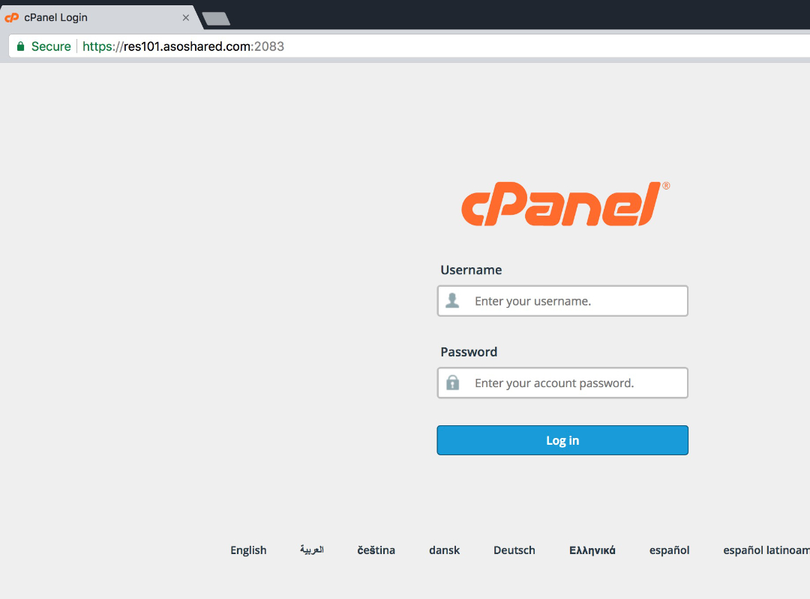
No se preocupe por la re-dirección pues lo más probable es que la URL se modifique.

Ahora ingrese con sus credenciales de cPanel, los cuales son:
Usuario/Username: `organitec`
Contraseña/Password: `ParaguayOrgSA2018`
_Asegúrese de que la contraseña no posea espacios al comienzo ni al final._

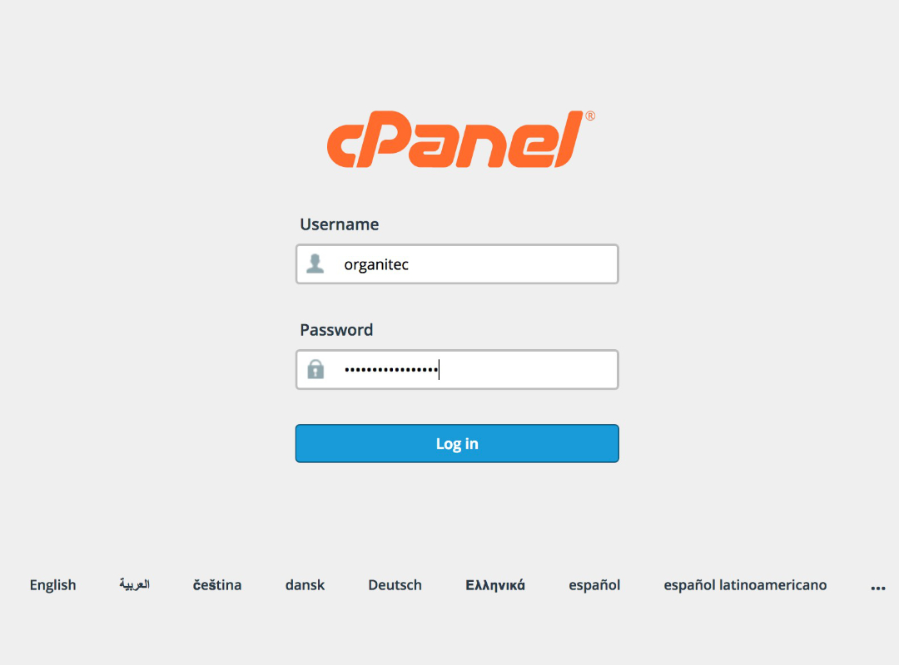
Clic que en «Log In» o presione el botón de «Enter».

Una vez dentro usted será bienvenido a su Panel o cPanel.
En ella podrá encontrar muchas opciones entre ellas, la capacidad de administrar sus archivos, ver estadísticas de su cuenta y por supuesto la creación de cuentas de correo electrónico.
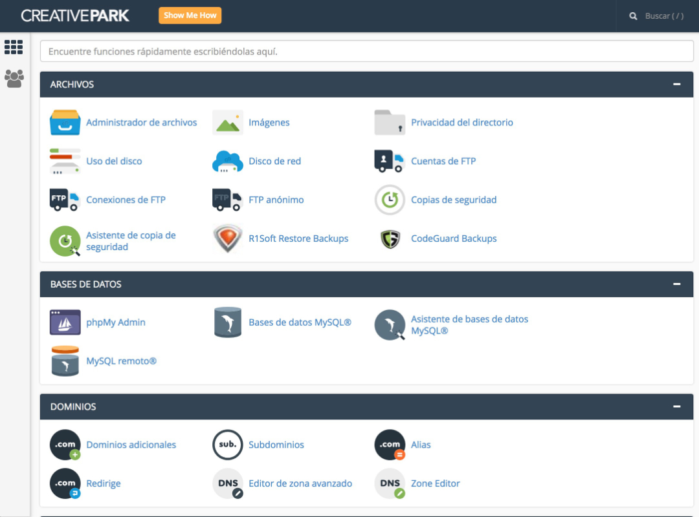

Puede fijarse a la barra lateral derecha contiene su información de cliente, así también como el uso de disco, banda ancha disponible, entre otras.
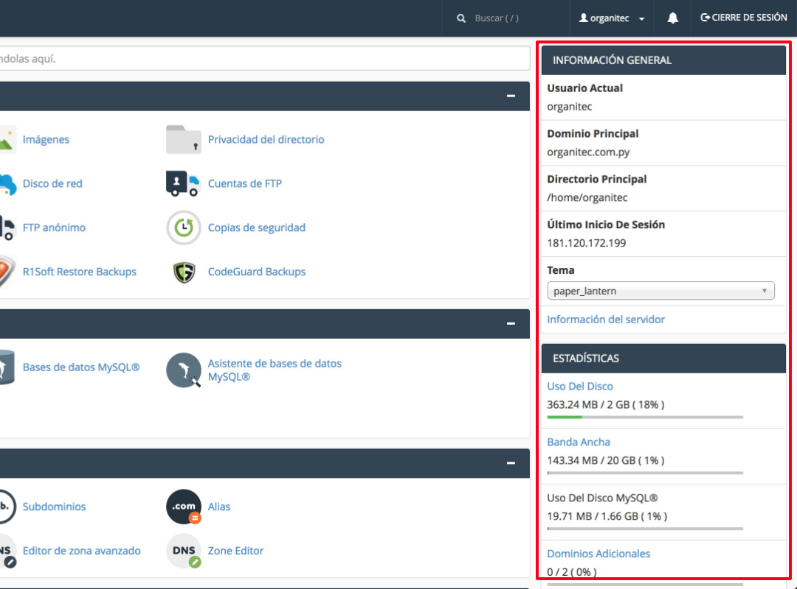
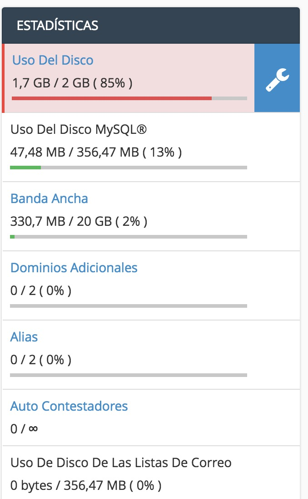

En este documento solo estamos interesados en la creación y edición de correos electrónicos así que iremos directo al área de correo escribiendo en la sección superior de búsqueda. Escribiendo la palabra «correo»
Inmediatamente se desglosaran los items correspondientes o que coincidan con la búsqueda realizada.
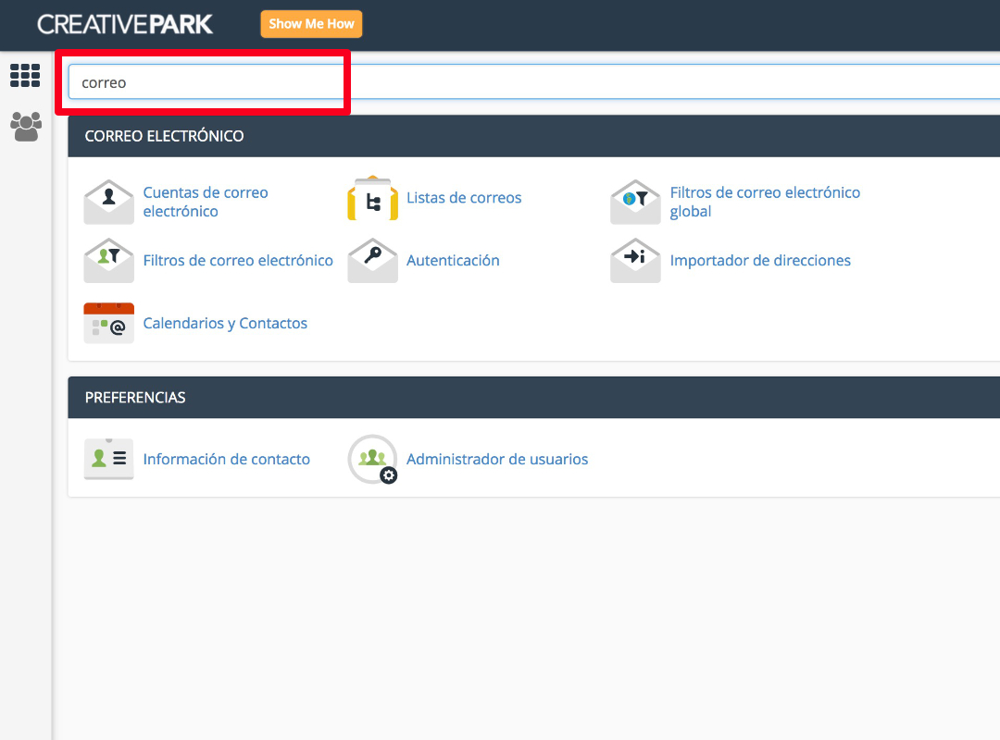

Le damos clic al item: «Cuentas de correo electrónico»
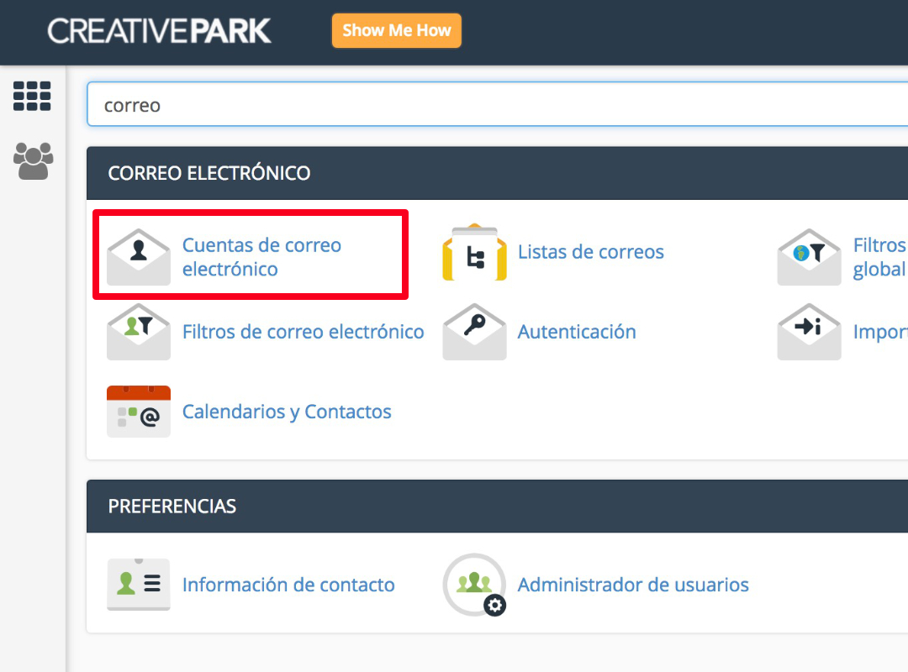

Avanzamos al siguiente menú:
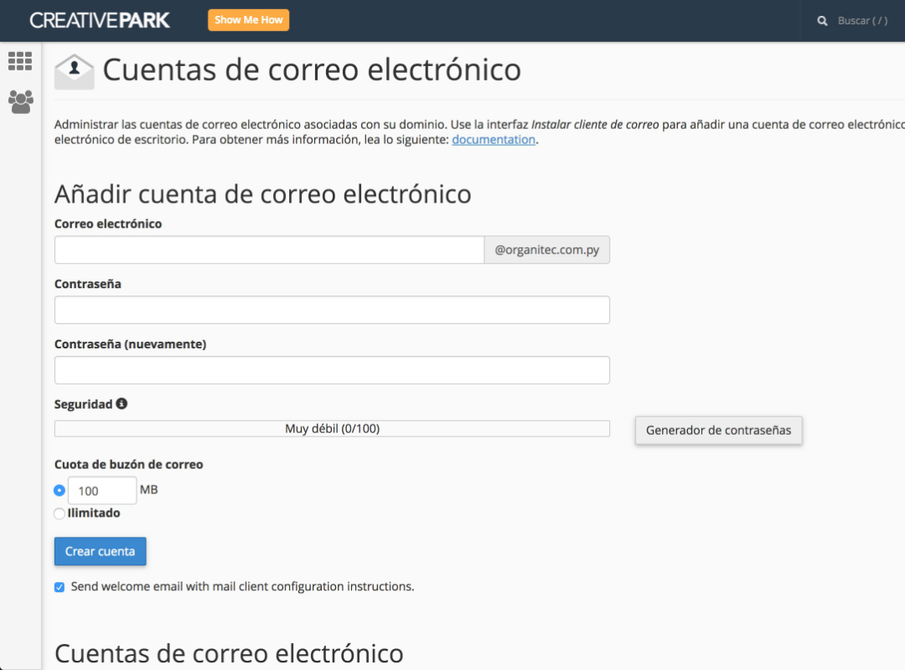
En este panel podremos crear las cuentas de correo que queríamos y podremos modificar la cuota de buzón y modificar la contraseña, no así ver la contraseña. Por motivos de seguridad, ni siquiera el administrador puede leer la contraseña, pero si reiniciarla o renovarla, en caso de olvidarse la contraseña.

## Ingresar al Correo electrónico por medio de Apps
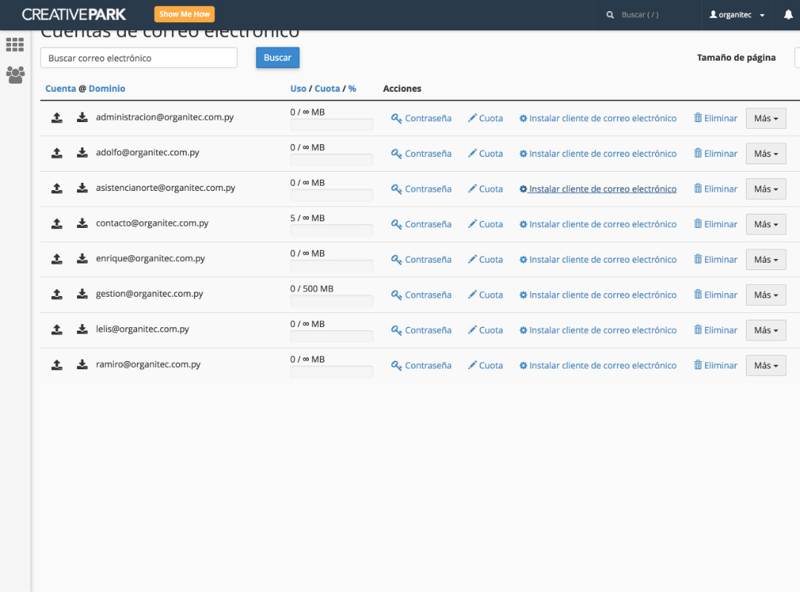
Una vez creado una cuenta podemos clicar en el botón «Instalar cliente de correo electrónico»

Una vez dentro verá el siguiente panel de configuración:
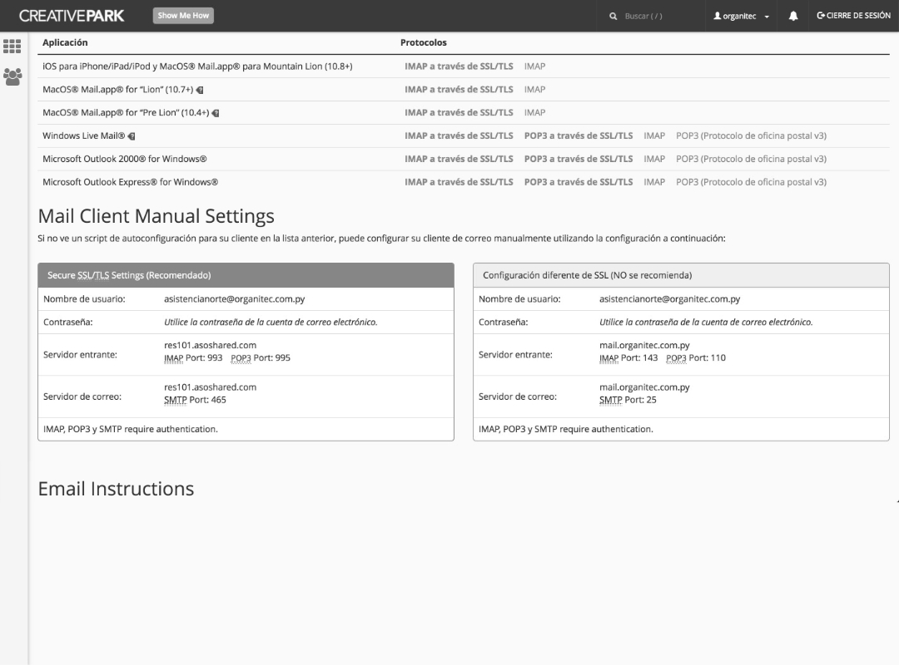
Aquí encontrará las distintas aplicaciones de clientes email. Por ejemplo Microsoft Outlook o macOS Mail. 

### Configuración de correo (Automático)
Elija su protocolo predilecto en la aplicación deseada. Si no sabe mucho sobre protocolos por lo general la primera opción es la mejor y más segura. Sería la opción de «IMAP a travéz de SSL/TLS»
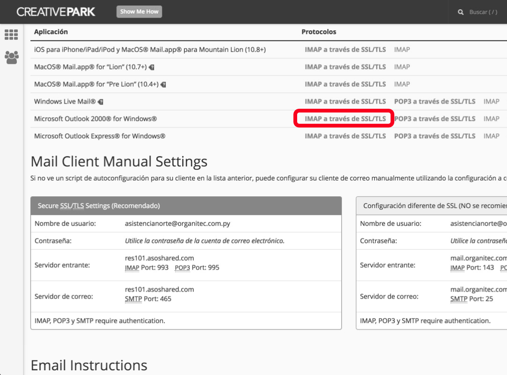

### Configuración de correo (Manualmente) 
Si no posee una de las cuentas mencionadas en la sección de aplicaciones. Puede emplear la configuración de correos manual.

En este ejemplo empleamos una computadora macOS High Sierra, con la aplicación Spark by Readable, también disponible para dispositivos iOS. App original: https://sparkmailapp.com/

**Seguiremos los sientes puntos:**
Nombre de usuario: Utilice su email creado. Por ejemplo: asistencianorte@organitec.com.py.
Contraseña: Utilice la contraseña de la cuenta de su correo electrónico. Qué es único para cada cuenta.
Servidor entrante / Inbox server: `res101.asoshared.com`
Puerto IMAP: `993` - Elija solo uno, por lo general se utiliza IMAP.
Puerto POP3: `995` - Si utilizo IMAP no utilice POP3 y viceversa.
Servidor de correo saliente / Outbox Server: `res101.asoshared.com`
Puerto SMTP: `465`
- IMAP, POP3 y SMTP requieren autenticación.

Dentro de la aplicación de correo «Spark» esto se vería de la siguiente manera:
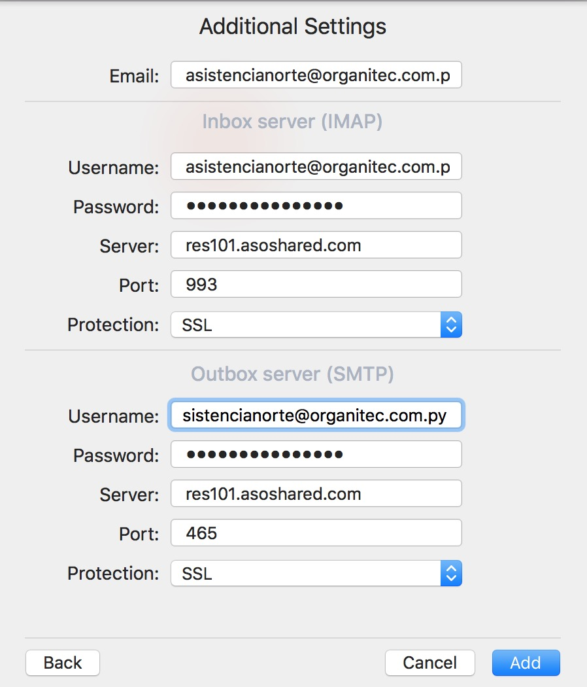
Por lo general las vistan son similares en todos los programas.

Y todo listo! Ahora puedes distribuir la nueva cuenta de correo o utilizarla en tu aplicación, por lo general no requiere colocar la contraseña nuevamente en las aplicaciones solo una sola vez.

## Ingresar al Correo electrónico por medio Web
Usted tiene como opción también ingresar directamente desde la web.
Vaya a [webmail.organitec.com.py](webmail.organitec.com.py)
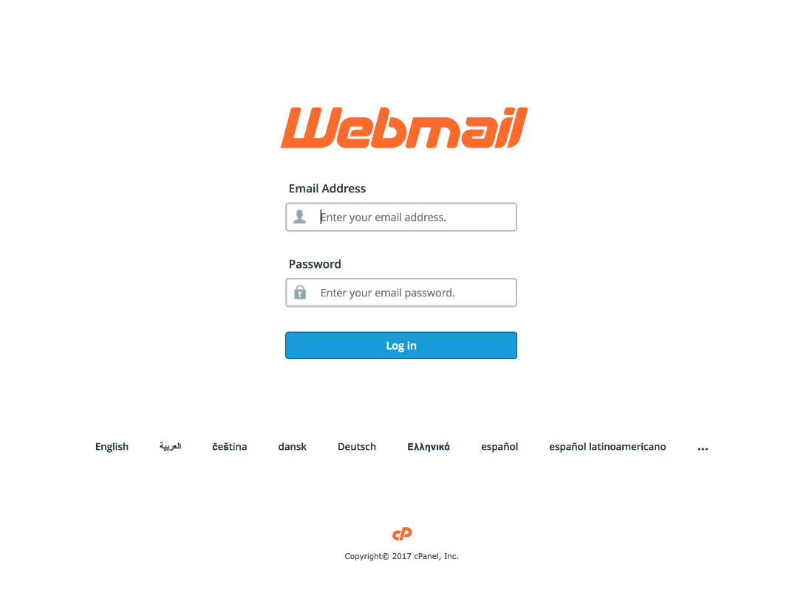
Tendrá una vista similar a la de cPanel. Solo que esta vez verá el logo Webmail como titulo principal. Aquí usted debe colocar como cualquier cuenta de correo, su Correo electrónico al cual usted desea entrar y la contraseña posteriormente.

Puede que al ingresar le salte el siguiente mensaje.
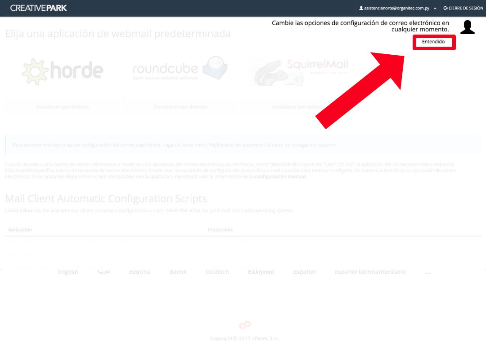
Simplemente del al botón «Entendido» para continuar.

Seleccione una opción de aplicación webmail. Por lo general el más común es «horde» pero si conoce alguno que le guste más también puede usarlo.
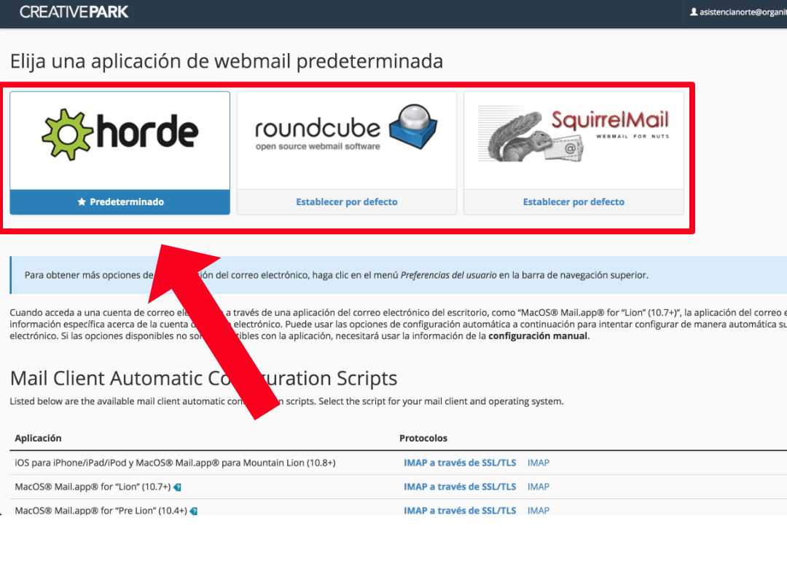
Si desconoce estos servicios simplemente seccione «horde»  como predeterminado. Y clique después en el botón del logo «horde» para utilizarlo inmediatamente.

Si used ve una pestaña similar a esta. Ya a ingreso con éxito!
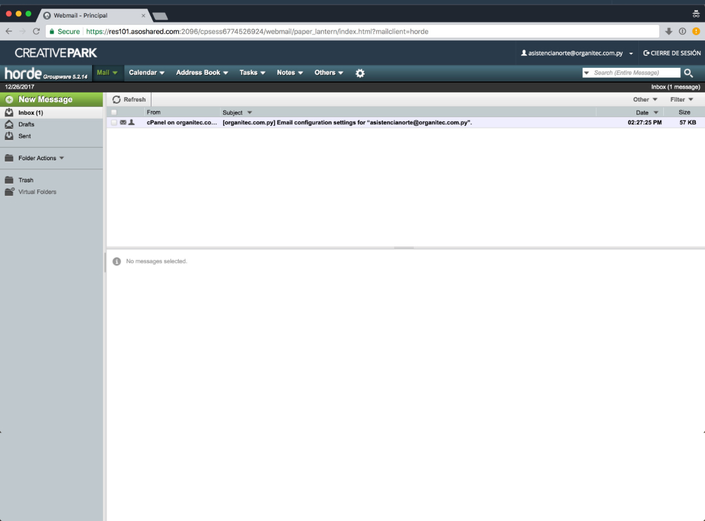

Espero le haya resultado de utilidad este manual.
Si tiene alguna dudo u consulta no dude en escribirnos a web@creativepark.com.py.

Si tiene unos minutos nos gustaría finalizar con una formulario de puntuación y reseña, para poder mejorar en el futuro, brindándole un mejor servicio. Le agradecemos cordialmente por su tiempo.

Jan Park
[Desarrollador web e Investigador de tecnología]